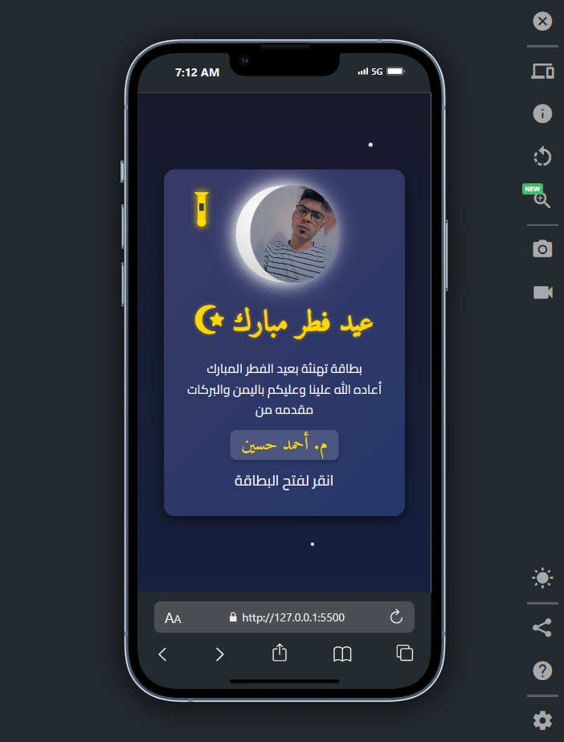

# Eid-Al-Fitr-Greetings

An interactive, animated greeting card to wish Eid Mubarak in Arabic. This project features a dynamic, crescent-moon style image, animated stars in the background, and flip animations on user interaction.

## Features

- **Interactive Flip Animation:** Click or press "Enter/Space" to flip the card and reveal the greeting message.
- **Animated Background:** A starry backdrop with twinkling stars to enhance the festive mood.
- **Crescent Moon Image:** The crescent moon is created using CSS clip-path with a custom background image.
- **Responsive Design:** Optimized for both desktop and mobile views.
- **Iconography:** Uses Font Awesome icons for visual enhancements.

## Live Demo

Experience the greeting card live here: [**Live Demo**](https://eng-ahmed-hussien.github.io/Eid-Al-Fitr-Greetings/)

## Technologies Used

- **HTML5**
- **CSS3** (including animations, transitions, and clip-path)
- **JavaScript**
- **Google Fonts:** [Amiri](https://fonts.google.com/specimen/Amiri) and [Cairo](https://fonts.google.com/specimen/Cairo)
- **Font Awesome**

## Getting Started

### Prerequisites

A modern web browser is all you need to run this project.

### Installation

1. **Clone the repository:**

   ```bash
   git clone https://github.com/yourusername/eid-greeting-card.git
   ```

2. **Navigate to the project directory:**

   ```bash
   cd eid-greeting-card
   ```

3. **Open the `index.html` file in your web browser.**

   You can also use a live server extension if you are using Visual Studio Code or similar.

## Customization

- **Crescent Moon Image:**  
  To change the image used inside the crescent moon shape, update the URL in the `.moon` CSS class:
  
  ```css
  background: url("https://randomuser.me/api/portraits/men/1.jpg") no-repeat center/cover;
  ```

- **Clip-Path Shape:**  
  Adjust the `clip-path` property in the `.moon` class to modify the crescent shape.

- **Text and Icons:**  
  Modify the HTML content or the Font Awesome classes as needed to customize the greeting card further.

## Screenshot



## License

This project is licensed under the [MIT License](LICENSE).

## Acknowledgements

- [Font Awesome](https://fontawesome.com/) for the icon set.
- [Google Fonts](https://fonts.google.com/) for the typography.
